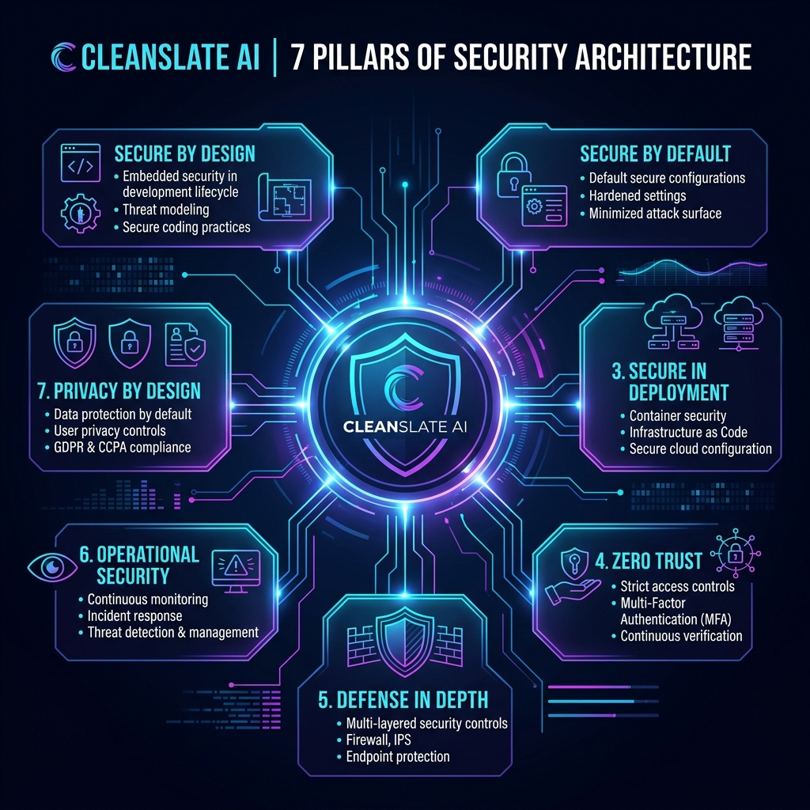
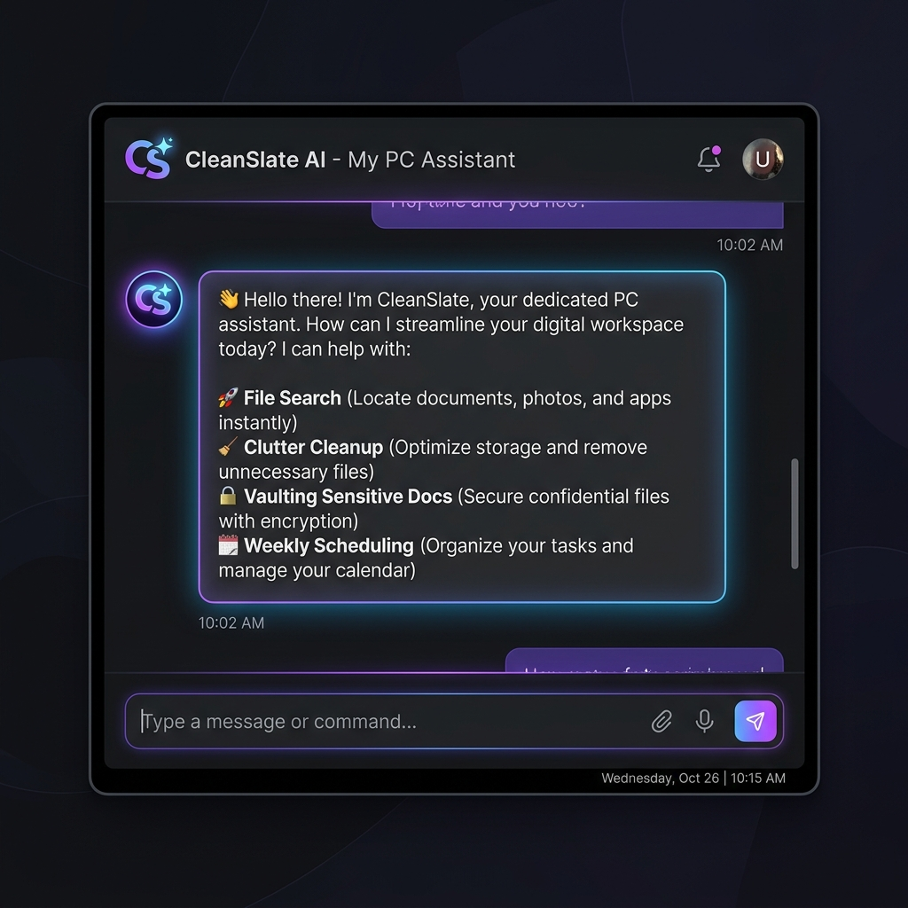
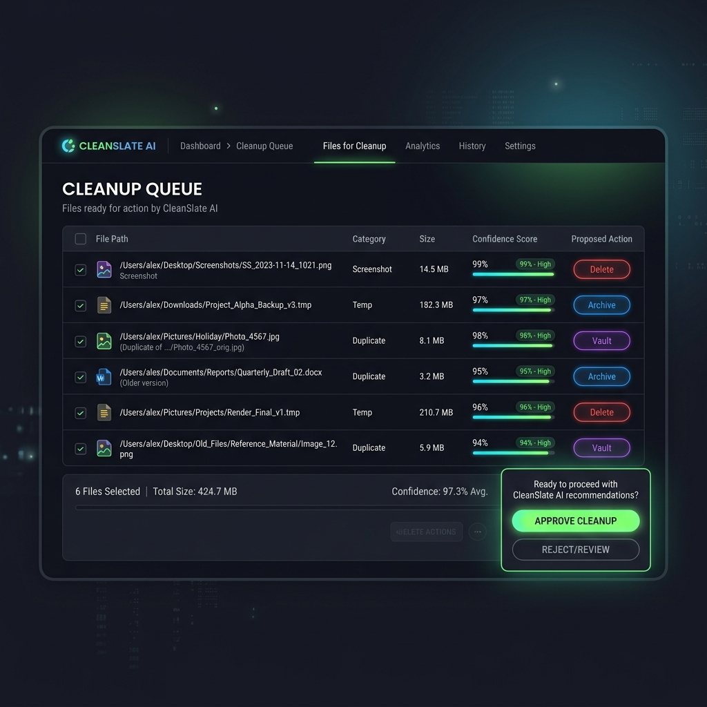

# 🧹 CleanSlate AI – My PC Assistant

> **"Your AI Chief of Staff for Digital Organization and Storage Management."**


## 📖 Problem Statement: Why We Built It
Modern computers accumulate massive digital clutter: downloads folders with thousands of files, duplicate documents and photos, old screenshots, large forgotten videos, unorganized project folders, cloud storage limits, and sensitive files stored in unsafe locations.

This clutter wastes time, increases cognitive load, and creates privacy risks. The problem is universal. Everyone experiences it, and no existing tool solves it intelligently. 

**CleanSlate AI** is an autonomous, multi-agent system that intelligently manages digital clutter, protects sensitive files, organizes storage, and provides a conversational PC assistant—all with strict human-in-the-loop safety. It is not just a “cleanup tool.” It is a **Digital Estate Manager**.

---

## 🌟 The Vision & Technical Decisions (Competition Highlights)
This project was built to showcase the effective use of Agentic AI technologies to solve a universal user problem: digital clutter. Our design philosophy centers around building a highly capable autonomous agent that prioritizes **safety, transparency, and user value**.

* **The Project Story & Vision**: We wanted an AI Chief of Staff that acts as a proactive digital estate manager. Instead of just answering questions, the agent needed to take agency over background maintenance while respecting strict privacy boundaries.
* **Solution Design**: We built a highly modular, multi-agent graph architecture. We separated concerns into discrete ADK nodes (File Discovery, Classification, Sensitive Detection, Optimization Planner) to ensure reasoning is traceable and debuggable.
* **Effective Use of Agent Technologies**: 
  * **Ambient Agents**: Using Pub/Sub, the agent can trigger weekly background organization tasks completely autonomously without user prompting.
  * **MCP (Model Context Protocol)**: We built native filesystem manipulation tools via MCP, giving the LLM secure, sandboxed access to local files without executing arbitrary code.
  * **Spec-Driven Development**: Every line of code traces back to the Master Specification, ensuring robust implementation quality and architectural integrity.
* **Overall User Value**: By blending conversational UX with ambient background processing and strict Human-In-The-Loop (HITL) safeguards, we deliver a premium, zero-anxiety digital cleanup experience.

---

## ✨ What It Does (Features & Workflows)
CleanSlate AI acts autonomously but respects strict boundaries to ensure user safety and data privacy.

- **Mandatory Folder Scope Approval**: Asks for and strictly enforces allowed/blocked directories before taking any action.
- **Intelligent File Discovery**: Scans local storage (Desktop, Downloads, Documents) and collects file metadata securely.
- **AI-Powered Classification**: Uses LLM reasoning to categorize files (Resume, Tax document, Medical record, Source code, Media, etc.).
- **Duplicate & Sensitive Detection**: Identifies exact/near duplicates and detects sensitive information (SSNs, Banking docs, Passwords) to protect them from deletion.
- **Storage Optimization**: Suggests archiving, compressing, moving, or deleting safe items to recover storage space.
- **Human-In-The-Loop (HITL) Review**: Provides explanations, confidence scores, and reasoning before requesting user approval for any destructive actions.
- **Weekly Auto-Organize (Ambient Agent)**: A background Pub/Sub job that automatically organizes your PC weekly based on your preferences.
- **Conversational Assistant**: Ask natural language queries like *"Find the file 'ambient expense agent'"* or *"Organize my screenshots."*

---

## 🔄 The Agentic Workflow

CleanSlate AI executes as a multi-node Directed Acyclic Graph (DAG) built with the Agent Development Kit (ADK 2.0). 

1. **Intent Routing (`MyPCAssistantNode`)**: Routes conversational queries to the right sub-flow (cleanup vs. search).
2. **Folder Scope Security (`FolderScopeNode`)**: Establishes the mandatory explicit security perimeter for the operation.
3. **File Discovery (`FileDiscoveryNode`)**: High-speed, metadata-only recursive traversal of approved directories.
4. **Classification (`ClassificationNode`)**: LLM-driven reasoning to categorize each file (e.g. Resume, Tax, Code, Media).
5. **Sensitive Detection (`SensitiveDetectionNode`)**: Uses strict heuristic and LLM checks to isolate highly sensitive files (SSNs, Passwords).
6. **Duplicate Detection (`DuplicateDetectionNode`)**: Groups identical files by tracking metadata and exact hashes.
7. **Optimization Planning (`OptimizationPlannerNode`)**: Generates an actionable cleanup plan (Move, Archive, Delete).
8. **HITL Approval (`HITLApprovalNode`)**: Formats the plan into an interactive UI and halts the graph execution until the user explicitly approves.
9. **Execution (`ExecutionNode`)**: Employs MCP tools to safely execute the approved plan (with built-in rollback logic).
10. **Summary & Dashboard (`SummaryNode`)**: Outputs the final recovery statistics and the secure pin-protected vault status.

---

## 🏗️ Architecture & Technologies Used

CleanSlate AI is built entirely via **Spec-Driven Development (SDD)**, meaning every feature traces directly back to a unified Master Specification.

### Core Technologies
- **ADK 2.0 (Agent Development Kit)**: The backbone of the agent graph workflow, managing complex state and multi-node decision-making.
- **Agent is Ambient**: Uses Pub/Sub mechanisms to trigger weekly background organization tasks completely autonomously.
- **MCP (Model Context Protocol)**: Exposes tools like filesystem scanners and file movers natively to the agent.
- **Agent CLI**: For rapid scaffolding, building, evaluating, and deploying the agent.
- **ADK SKILLS**: Leveraged for building specialized capabilities into the AI workflows.
- **Semgrep Security Hooks**: Enforces SDD safety rules (like preventing LLM file content uploads) statically during the CI/CD and commit pipeline.
- **Antigravity**: Used for deep integration, observability, and complex agent interactions.
- **Logging & Traceability**: Comprehensive telemetry ensuring every action is recorded for auditability and rollback capabilities.

---

## 🔒 7-Pillar Security Architecture (The 7 Principles & STRIDE)

CleanSlate AI was designed using the **STRIDE Threat Model** (Spoofing, Tampering, Repudiation, Information Disclosure, Denial of Service, and Elevation of Privilege) to harden the agent against prompt injections, unauthorized filesystem access, and exfiltration.



It adheres strictly to the **7 Pillars of Security**:

### 1. Secure by Design
* **Sensitive File Isolation**: Proactive identification of sensitive content (SSNs, API keys, tax forms).
* **Secure Vault**: Protected `Authenticated_Secure` directory with localized access controls.
* **Access Recovery**: Dual-factor authentication using a localized PIN and customizable security question.
* **Runtime Constraints**: Strict runtime safety gates preventing unauthorized system calls.

### 2. Secure by Default
* **Non-Destructive Vaulting**: Sensitive files are never deleted; they are securely moved to the vault.
* **Implicit Dry-Run**: Safety-first execution flow presenting proposed changes prior to making modifications.
* **Universal Rollback**: Complete transaction logs recorded to revert any file system operations (rename, move, delete).

### 3. Secure in Deployment
* **Sandbox Integration**: Tested and verified to operate safely in restricted cloud sandboxes (e.g., Kaggle, remote VMs).
* **No Exfiltration**: Zero external network requests allowed during execution, retaining all sensitive data locally.
* **Traversal Defense**: Absolute path enforcement and blocking of parent directory traversal (`..`).

### 4. Zero Trust
* **Explicit Scoping**: The Folder Scope Policy acts as a hard boundary—unapproved directories are completely invisible to the agent.
* **Authentication Boundaries**: Re-authenticates requests targeting the secure vault to prevent privilege creep.
* **Input Sanitization**: Rejects and sanitizes raw user inputs, including leading/trailing quote stripping and slash normalization.

### 5. Defense in Depth
* **Layered Pipeline**: Executes in distinct sequential phases: Discovery ➔ Local Pattern Matching ➔ LLM Classification ➔ Vault Encryption ➔ Transaction Logging.
* **Heuristics & LLM Co-Verification**: Fallback regex rules verify classification to ensure security even when API connections are degraded.

### 6. Operational Security
* **Full Auditability**: Logs every node transition, LLM decision, user input, and file modification.
* **Telemetry Protection**: Erases sensitive file details from execution summaries and telemetry outputs.
* **Graceful Degradation**: Recovers safely from file locks, permissions issues, or API timeout failures without leaving partial transactions.

### 7. Privacy by Design
* **Filename Masking**: Redacts and masks sensitive filenames (e.g., `[RESTRICTED]/SSN_****.txt`) in logs and UI lists.
* **Content Blindness**: Restricts the LLM from reading file content; the agent works exclusively with metadata.
* **PII Redaction**: Auto-filters any personally identifiable information (PII) from user-facing reports.

---

## 🚀 Getting Started

### Prerequisites
- **Python 3.11+** and **uv** (recommended)
- **Google AI Studio Gemini API Key**

### 🟦 10. Setup Instructions

#### 1. Clone the Repository
```bash
git clone https://github.com/divya-gh/CleanSlate-AI-PC-Assistant.git
cd CleanSlate-AI-PC-Assistant
```

#### 2. Set up the Python Virtual Environment & Install Dependencies
* **Using `uv` (Recommended)**:
  ```bash
  # This will automatically create the virtual environment and install all dependencies
  uv sync
  ```

* **OR using standard `pip`**:
  ```bash
  python -m venv .venv
  source .venv/bin/activate  # On Windows use: .venv\Scripts\activate
  pip install -r requirements.txt
  ```

#### 3. Configure Environment Variables
Create a `.env` file and add your Gemini API Key:
```bash
echo "GEMINI_API_KEY=your_api_key_here" > .env
```

#### 4. Run the ADK Backend Server
```bash
python run.py
```

#### 5. Launching the UIs
CleanSlate AI supports two interfaces. Open a new terminal to start your preferred UI:

* **ADK Dev UI (Built-in)**:
  Access via `http://127.0.0.1:8080/dev-ui/` automatically when running `run.py`.

* **Custom Web UI**:
  Run the custom chat interface:
  ```bash
  python launcher_server.py
  ```
  Access via `http://localhost:8000`

---

## 🎥 Demos

| Custom Web UI | ADK Dev UI |
| :---: | :---: |
| <video width="100%" controls><source src="docs/assets/custom-ui-demo.mp4" type="video/mp4"></video><br>_Showcasing the premium Chat Interface_ | <video width="100%" controls><source src="docs/assets/adk-dev-ui-demo.mp4" type="video/mp4"></video><br>_Showcasing the Developer ADK Dashboard_ |

### 🖥️ User Interface Screenshots

| 💬 Welcome Chat Interface | 📋 Human-in-the-Loop Approval |
| :---: | :---: |
|  |  |
