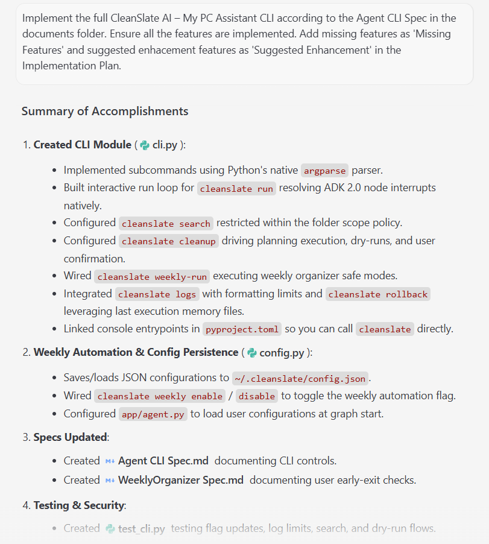
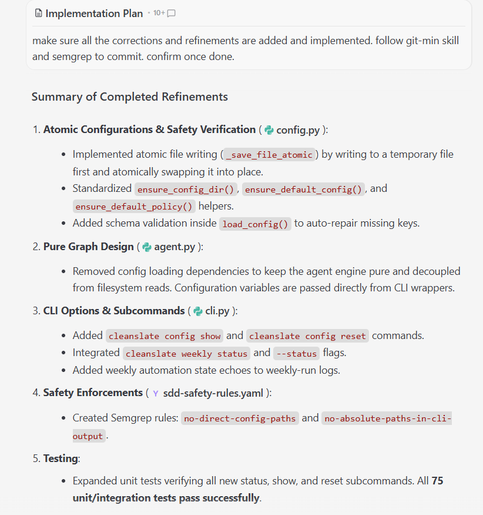

# Implement Agent CLI in CleanSlate AI — Your Digital Estate Manager 
in accordance with [Agent CLI SPEC](../SPECS/Agent_CLI_SPEC_V2.md)

-------

## Step 1: Building CLI in Antigravity

- Open Antigravity
- In Antigravity cleanslate-pc-assistant project,

### • Prompt: 
```
Implement the full CleanSlate AI – My PC Assistant CLI according to the Agent CLI Spec in the documents folder. Ensure all the features are implemented. Add missing features as 'Missing Features' and suggested enhacement features as 'Suggested Enhancement' in the Implementation Plan.
This CLI does not exist yet, so create it from scratch.
====================================================
1. Create CLI Module
====================================================
Create a new file:
- app/cli.py

Use Python’s argparse or click (choose one and be consistent).

Create a main() entrypoint that supports:
cleanslate <command> [options]

Add console_script entry in pyproject.toml so the user can run:
cleanslate run

====================================================
2. Implement User Commands
====================================================
2.1 cleanslate run
- Start MyPCAssistantNode in interactive mode.
- Simple terminal loop: read user input → send to agent → print response.

2.2 cleanslate search "<query>" [--json] [--path <folder>]
- Trigger MyPCAssistantNode in search mode.
- Use FileDiscoveryNode under the hood.
- Respect folder_scope_policy.
- Output JSON if --json is passed.

2.3 cleanslate cleanup
- Trigger cleanup workflow.
- Run FolderScopeNode to collect allowed/blocked folders.
- Require HITL approval.
- Run ExecutionNode and SummaryNode.

2.4 cleanslate weekly-run
IMPORTANT: integrate weekly automation flag.
- Load config (see section 4).
- If weekly_automation_enabled == False:
    print “Weekly automation disabled. Enable it with: cleanslate weekly enable”
    exit(0)
- If True:
    run WeeklyOrganizerNode in safe_mode
    print summary

2.5 cleanslate logs [--limit N] [--json]
- Read from CLEANSLATE_LOG_PATH.
- Redact sensitive paths.
- Output JSON if requested.

2.6 cleanslate rollback
- Trigger RollbackNode.
- Print rollback summary.

2.7 cleanslate scope reset
- Clear stored folder scope policy.
- Next cleanup requires re-approval.
====================================================
3. Implement Weekly Automation Control Commands
====================================================
Add two new commands:
3.1 cleanslate weekly enable
- load_config()
- set weekly_automation_enabled = True
- save_config()
- print “Weekly automation enabled.”

3.2 cleanslate weekly disable
- load_config()
- set weekly_automation_enabled = False
- save_config()
- print “Weekly automation disabled.”

====================================================
4. Implement Config Persistence
====================================================
Create config file:
~/.cleanslate/config.json

Schema:
{
  "weekly_automation_enabled": false
}

Add helper functions:
- load_config()
- save_config()

If file does not exist, create it with defaults.

====================================================
5. Graph Wiring
====================================================
Modify agent.py so that:
- At graph initialization, load config.
- Pass weekly_automation_enabled into WeeklyOrganizerInput.
- WeeklyOrganizerNode already supports early exit when disabled.

====================================================
6. Update Specs
====================================================
A. Update Agent CLI Spec:
- Add weekly enable/disable commands.
- Update weekly-run behavior to check config flag.

B. Update WeeklyOrganizer Spec:
- Add “Weekly automation runs only when enabled by user.”
- Add disabled-case summary behavior.

====================================================
7. Tests
====================================================
Add tests:
test_cli_weekly_enable_sets_flag
- Run CLI command.
- Assert config.json updated.

test_cli_weekly_disable_sets_flag
- Same as above.

test_cli_weekly_run_respects_flag
- If disabled → CLI prints message and does not run node.
- If enabled → node runs and summary is printed.

test_cli_search
test_cli_cleanup_dry_run
test_cli_logs_limit

====================================================
8. Final Steps
====================================================
Run:
uv run pytest
pre-commit run --all-files

Commit:
Subject: "cli"
Body: "Add full CleanSlate CLI with weekly automation control, config persistence, and graph integration." 

```
•	Confirm:
| 📸 Agent CLI Implimentation 1 | 📸 2| 
| :---: | :---: |
|  |  |


