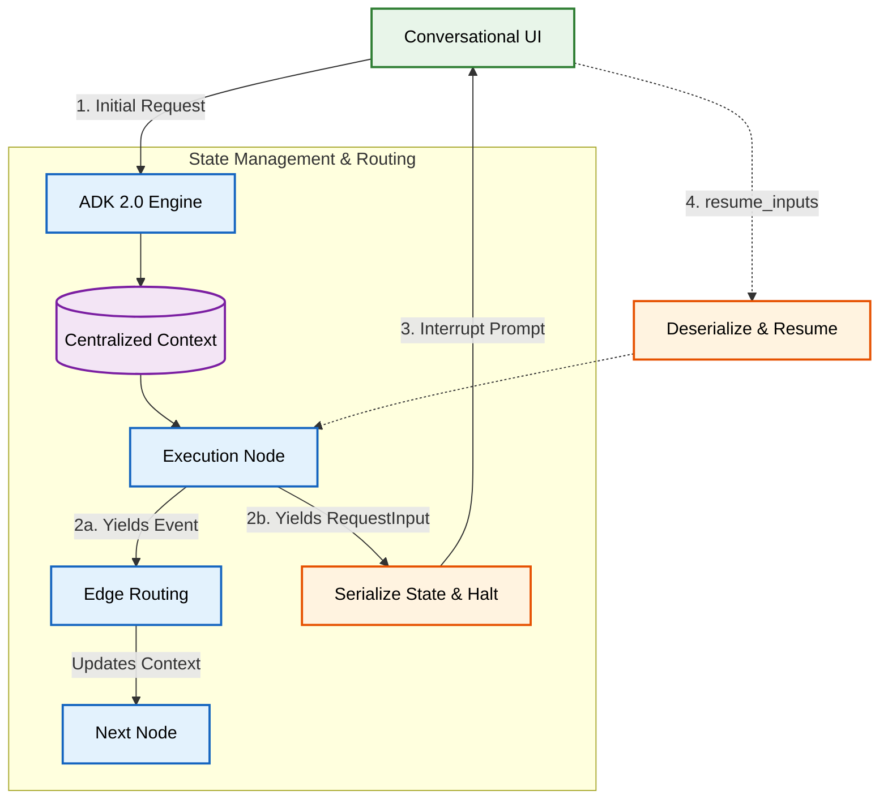

# Agent Orchestration & State Management

CleanSlate AI leverages the **Google Agent Development Kit (ADK 2.0)** to orchestrate a complex pipeline of language models, local tools, and user interrupts.



## Resumability and Interrupts

A defining feature of CleanSlate AI's orchestration is its use of the `ResumabilityConfig`. Since the agent touches the user's personal filesystem, it strictly adheres to a Human-in-the-Loop (HITL) philosophy.

1. **The Suspension:** When the DAG reaches the `FolderScopeNode` (to verify the scope) or the `HITLApprovalNode` (to verify the execution plan), the node yields a `RequestInput` event.
2. **State Persistence:** The ADK infrastructure halts the DAG and serializes the current execution state (including the proposed execution plan and discovered file paths).
3. **The Resumption:** Once the user reviews the prompt and provides approval via the conversational UI, the frontend sends a `resume_inputs` payload. The ADK deserializes the state, routes back to the suspended node, and execution continues securely.

## Event Routing

The entire system is glued together by `Event` and `EventActions`. Nodes communicate exclusively by yielding events that determine the next topological path.

Example:
```python
# From app/agent.py
(n_planner, {
    "execute": n_exec,
    "no_actions": n_summary,
}),
```
If the Optimization Planner finds no clutter, it yields a `no_actions` event, bypassing the execution pipeline and routing directly to the summary, saving compute and time.

## Centralized Context

The agent maintains a rich `Context` object as it traverses the DAG. As files are discovered, classified, and analyzed for sensitivities, their metadata is appended to the context. This allows downstream nodes (like the ExecutionNode) to act deterministically without needing to re-scan the filesystem or re-query the LLM, ensuring speed and reliability.
