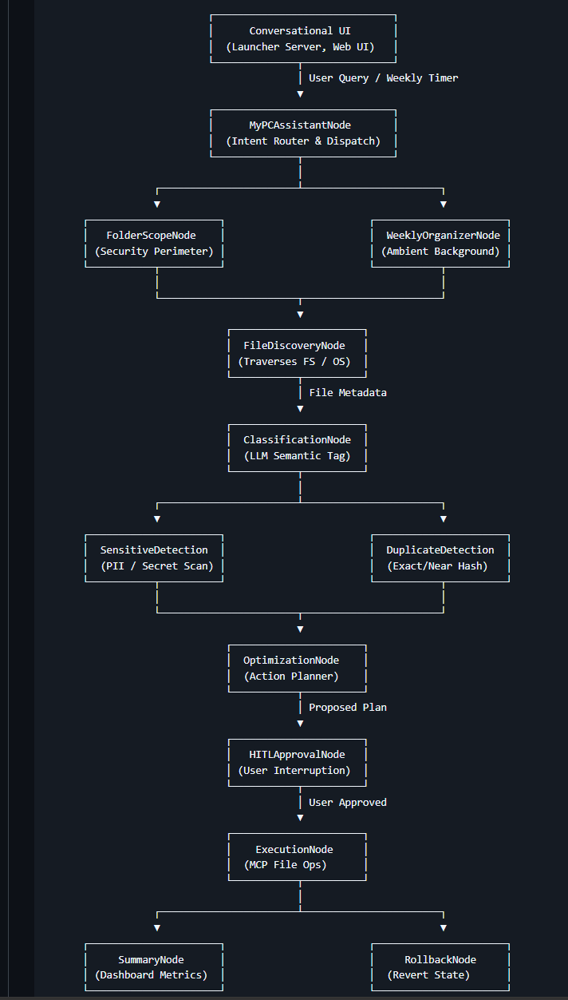
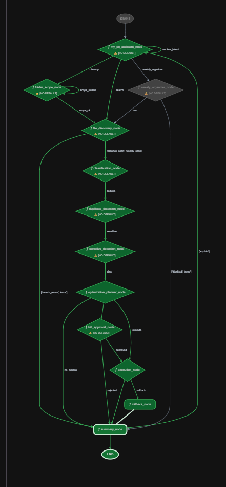

# CleanSlate AI - DAG Architecture

---
### CleanSlate AI is built using the **Agent Development Kit (ADK 2.0)** and operates as a Directed Acyclic Graph (DAG). The agent traverses different nodes depending on the user's initial intent and the outcomes of internal reasoning steps.

---
## Core Node Execution Flow

1. **MyPCAssistantNode (The Router)**
   - **Purpose:** Acts as the main entry point and conversational interface.
   - **Routing:** Analyzes the user's natural language request and routes to:
     - `cleanup`: Triggers the full PC cleanup pipeline (starts at FolderScope).
     - `search`: Triggers a specific file search.
     - `weekly_organizer`: Activates ambient background tasks.
     - `explain`/`unclear`: Handles conversational Q&A or requests clarification.

2. **FolderScopeNode**
   - **Purpose:** Security boundary.
   - **Action:** Halts execution to ask the user for explicit permission regarding which directories to scan (Allowed/Blocked). 
   - **Routing:** Only proceeds to discovery if the scope is validated (`scope_ok`).

3. **FileDiscoveryNode**
   - **Purpose:** Scans the local filesystem securely within the approved scope.
   - **Action:** Collects metadata, sizes, and paths.

4. **ClassificationNode**
   - **Purpose:** AI-powered categorization.
   - **Action:** Uses LLM reasoning to tag files (e.g., Resume, Tax Document, Source Code, Media).

5. **DuplicateDetectionNode**
   - **Purpose:** Identifies exact and near-duplicate files to reclaim storage space.

6. **SensitiveDetectionNode**
   - **Purpose:** Enterprise-grade security pass.
   - **Action:** Scans metadata/content for PII (SSNs, Driver's Licenses, Passwords, API Keys) and flags them to be moved to the **Authenticated Secure Folder** rather than deleted.

7. **OptimizationPlannerNode**
   - **Purpose:** Creates a deterministic execution plan.
   - **Action:** Drafts a list of proposed actions (archive, compress, move, delete).

8. **HITLApprovalNode (Human-In-The-Loop)**
   - **Purpose:** Safety check.
   - **Action:** Presents the Optimization Plan to the user and suspends the DAG until explicit approval or rejection is received.

9. **ExecutionNode & RollbackNode**
   - **ExecutionNode:** Safely executes the approved file system operations.
   - **RollbackNode:** Triggered if a failure occurs during execution, reversing any destructive actions to guarantee system integrity.

10. **SummaryNode**
    - **Purpose:** Produces a final, color-coded summary report and audit log for the user.

## Visual Flow
`Assistant` -> `Scope` -> `Discovery` -> `Classify` -> `Dedupe` -> `Sensitive` -> `Planner` -> `HITL` -> `Execution` -> `Summary`

| 📸 ADK DAG Architecture (Backend) | 📸 Playground Dev‑UI (DAG Frontend) |
| :---: | :---: |
|  |  |
