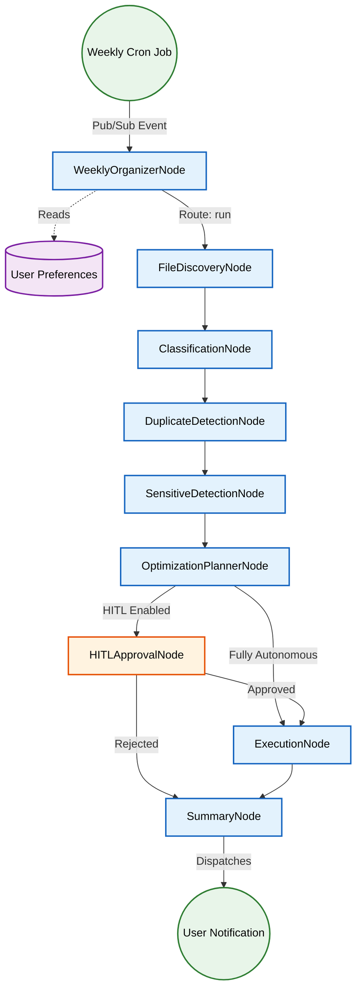

# 🌊 Ambient Agent: Pub/Sub Flow

CleanSlate AI features an ambient background capability, referred to as the **Weekly Organizer Node**. Instead of requiring the user to manually trigger a cleanup, this node allows the agent to organize files automatically on a scheduled cadence (e.g., weekly).

## How it Works

#### 1. 🚨 **Trigger Mechanism**
   - The Weekly Organizer operates via a simulated Pub/Sub cron architecture. 
   - A background process triggers the `weekly_organizer_node` within the ADK graph.

#### 2. ⭐ **Preference Loading**
   - Upon triggering, the agent securely reads the user's saved preferences (e.g., target folders to organize, file types to target, whether to ask for approval or run fully autonomously).

#### 3. 🧵 **Workflow Routing**
   - Instead of routing through the conversational `MyPCAssistantNode`, the weekly trigger routes directly into the `FileDiscoveryNode`.
   - The sequence follows:
     `WeeklyOrganizerNode` -> `FileDiscoveryNode` -> `ClassificationNode` -> `DuplicateDetectionNode` -> `ExecutionNode`
   
#### 4. 🤝 **Autonomous Execution vs. HITL**
   - If the user prefers strict control, the DAG halts at `HITLApprovalNode` and sends an alert to the user's device, waiting for approval before execution.
   - If configured for full autonomy, it safely executes non-destructive actions (like categorizing files into folders) and moves sensitive files to the secure vault without interrupting the user.

5. 🔔 **Notification**
   - Finally, it routes to the `SummaryNode` to dispatch a notification and summary report regarding what was achieved in the background.
  
---
## 🔀 {} Code & ⇄ Routing:
**The core logic for the `Pub/Sub flow (Weekly Organizer`) is located here: app/nodes/[weekly_organizer_node.py](../../app/nodes/weekly_organizer_node.py)**

**And the `routing` that wires this node into the rest of the `DAG` is defined here: [app/agent.py](
../../app/agent.py)**
