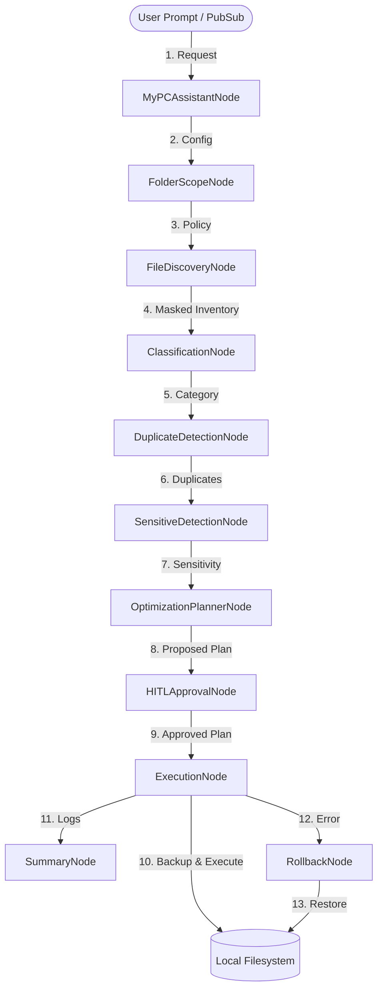

# STRIDE Threat Model — CleanSlate PC Assistant

This document provides a systematic STRIDE threat modeling assessment for the CleanSlate PC Assistant (ADK 2.0 implementation).

---

## 1. Overview & Objectives

CleanSlate PC Assistant is an agentic tool designed to safely and transparently declutter, clean, and organize user PC directories. Because it interacts directly with the local file system and employs external LLM services (Gemini), securing it against unauthorized actions, information leakage, and tampering is paramount.

This threat model outlines system boundaries, workflows, potential threat vectors, and existing or recommended mitigations across all STRIDE categories.

---

## 2. System Boundaries

- **Entry Points**: User text prompts (via `MyPCAssistantInput`) and weekly triggers (via `WeeklyOrganizerInput`).
- **Privileged Boundaries**: `ExecutionNode` (filesystem write operations), `RollbackNode` (filesystem restorations), and `FolderScopeNode`/`HITLApprovalNode` (user validation and path lockdowns).
- **Data Stores**: Local user directories (constrained by `allowed_paths`), rollback backups (`.rollback/`), and in-memory session logs.

---

## 3. Workflow Trace

1. **Cleanup Workflow**:
   - Matches intent $\to$ prompts folder scope (locks boundaries) $\to$ scans inventory (masks sensitive paths) $\to$ classifies files (safe previews) $\to$ detects duplicates $\to$ isolates sensitive files $\to$ plans optimizations $\to$ interrupts for HITL approval $\to$ executes changes securely $\to$ writes final summary report. (Note: Rollback is only triggered on execution failure, not on skipped actions.)
2. **Search Workflow (Short Loop)**:
   - Matches intent $\to$ scans matches $\to$ returns results directly to user. Bypasses classification, reasoning, and planner/execution completely to prevent unnecessary CPU usage and exposure.
3. **Weekly Organizer Workflow**:
   - Automated via Pub/Sub $\to$ sets `safe_mode=True` $\to$ scans and classifies $\to$ planner blocks deletes/compressions/archives $\to$ bypasses HITL $\to$ ExecutionNode executes moves to `WeeklyReview/` or `Authenticated/` only $\to$ aggregates summary.

---

## 4. STRIDE Threat Analysis

### Spoofing (Caller Identity or Intent Faked)
- **Threat Vector**: A malicious user or script triggers weekly automation with a customized `FolderScopePolicy` containing blocked system paths, bypassing input checks.
- **Likelihood**: Medium | **Impact**: High
- **Existing Mitigations**:
  - `WeeklyOrganizerNode` and `FolderScopeNode` enforce that policies are validated against strict structural rules (no overlapping paths, no relative paths, no system folders).
  - Validation checks are hardcoded and do not rely on LLM reasoning.
  - ExecutionNode never trusts upstream nodes; it re-validates paths.
- **Recommended Improvements**: Secure the Pub/Sub listener wrapper using cryptographic validation.

### Tampering (Unsanitized Configuration or Workflow Modification)
- **Threat Vector**: An attacker manipulates state variables or injects a custom cleanup plan (e.g. replacing a move action with a deletion of a system file) in the middle of execution.
- **Likelihood**: Low | **Impact**: High
- **Existing Mitigations**:
  - `ExecutionNode` runs *redundant runtime checks* (`_is_path_allowed`, `_is_path_blocked`, `_is_system_folder`) on every action right before modifying the disk.
  - Overwrite prevention: file moves fail if target paths are already occupied.
- **Recommended Improvements**: Planner -> ExecutionNode communication should be signed (future).

### Repudiation (User Denies Actions or Approvals)
- **Threat Vector**: A user claims the agent deleted files without permission.
- **Likelihood**: Low | **Impact**: Medium
- **Existing Mitigations**:
  - `HITLApprovalNode` explicitly records the user reply (`yes`/`y`) and lists approved actions in the session history.
  - Complete logs detailing actions and reasoning are generated.
- **Recommended Improvements**: Store logs in a read-only metadata folder.

### Information Disclosure (Sensitive Data Leakage)
- **Threat Vector**: Sensitive file names, paths, or contents are uploaded to the Gemini API during classification/sensitive detection, or leaked in user-facing reports.
- **Likelihood**: Medium | **Impact**: High
- **Existing Mitigations**:
  - Filename masking: `FileDiscoveryNode` replaces sensitive filenames with hashes (`sensitive_file_<hash>`) in memory before sending list outputs downstream. Sensitive files should never appear in error messages.
  - Preview constraints: Previews are strictly limited to plain-text extensions, truncated to 512 bytes, and decoded with `errors="ignore"`. No binary data, base64, or image streams are ever sent.
  - Safe PDF extraction: PyPDF2 extracts text from PDFs and truncates to 512 chars instead of sending raw binary streams.
  - Report sanitization: `SummaryNode` replaces absolute paths with "a protected file" when reporting errors or logs.
- **Recommended Improvements**: Mask files classified as `source_code` or `medical` immediately upon identification.

### Denial of Service (Excessive Workspace Overloads)
- **Threat Vector**: The user configures `allowed_paths` to the root directory `C:/` or a directory with cyclic symbolic links, causing resource exhaustion or infinite loops.
- **Likelihood**: Medium | **Impact**: Medium
- **Existing Mitigations**:
  - Traversal depth limit: maximum depth of 10 subdirectories.
  - Max file limit: scans are terminated if file counts exceed 1,000.
  - Symlinks and hardlinks are explicitly rejected during scan.
- **Recommended Improvements**: Add CPU + memory budget caps.

### Elevation of Privilege (Bypassing Execution Constraints)
- **Threat Vector**: An action plan triggers deletions under `safe_mode=True` by bypassing planner limits.
- **Likelihood**: Low | **Impact**: High
- **Existing Mitigations**:
  - `ExecutionNode` enforces runtime safe mode constraints: `delete` and `compress` are blocked at execution if `policy.safe_mode=True`.
  - All directory writes and moves are sandboxed under `allowed_paths`.
- **Recommended Improvements**: ExecutionNode should reject absolute paths outside allowed_paths even if planner fails.

---

## 5. Mitigation Summary

| Category | Threat | Mitigations | Status | Residual Risk |
| :--- | :--- | :--- | :--- | :--- |
| **S** | Spoofing intents | Hardcoded heuristics fallback, strict input validation. | Implemented | Low (Gated by strict input syntax parsing) |
| **T** | Plan tampering | Double-safety checks right before file writes inside `ExecutionNode`. | Implemented | Low (ExecutionNode enforces boundaries regardless of source) |
| **R** | Repudiation | Mandatory HITL logging, detailed summaries with error tracking. | Implemented | Low (Read-only metadata logging covers historical changes) |
| **I** | Leakage of sensitive data | Deterministic filename hashing, plain-text 512-byte preview limits. | Implemented | Medium (LLM context window holds safe/hashed variants) |
| **D** | Infinite scan loops | Symlink rejection, directory depth limits (10), file cap (1000). | Implemented | Low (Hard resource caps prevent thread lockups) |
| **E** | Safe mode bypass | Safe mode double-guards in execution node blocking deletes. | Implemented | Low (Double-checked bounds reject unsafe modes) |

---

## 6. Residual Risk & Future Improvements

1. **OS-Level Process Isolation**: The assistant currently runs with the user's shell privileges. Restricting process-level access using standard sandboxing is recommended.
2. **Gemini API Isolation**: When sending masked filenames and text previews to Gemini, there is a minor risk of context leakage. Restricting LLM prompts to system-approved templates minimizes this.
3. **Future**: MCP tools must enforce their own permission model.
