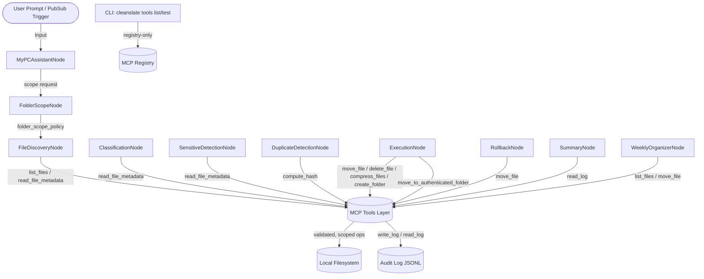

# STRIDE Threat Model — CleanSlate AI: Your Digital Estate Manager

**Version**: 2.0  
**Date**: 2026-06-28  
**Status**: Updated for MCP Tools, ADK 2.0 Nodes, Semgrep Enforcement, Audit Logging

> This document supersedes threat_model v1.x. All filesystem access now flows exclusively through the MCP tools layer. No ADK node touches the filesystem directly.

---

## 1. Overview & Objectives

CleanSlate AI is an agentic PC assistant that safely declutters, classifies, and organizes user files. It uses ADK 2.0 for orchestration and an MCP (Model-Context-Protocol) tool layer for all filesystem operations.

**Core security invariants enforced in this version:**

| Invariant | Enforced By |
|---|---|
| Nodes never touch filesystem directly | Semgrep rules #24, #25, #26 |
| File contents never read or uploaded | Semgrep rules #11, #12 |
| All paths validated before use | `validate_path_safety()` in `utils.py` |
| Sensitive files never deleted | `delete_file` + Semgrep rule #3 |
| Deletes require HITL approval | `delete_file(hitl_approved=True)` |
| Audit log is append-only, redacted | `audit_logger.py` + `write_log`/`read_log` |
| Registry is pure (no FS/policy access) | Semgrep rule #16 |
| No absolute paths in CLI output | Semgrep rule #15 + `_sanitize_path()` |

---

## 2. System Boundaries & Entry Points

### Entry Points

| Entry Point | Trust Level | Validation |
|---|---|---|
| User text prompt | Untrusted | ADK intent routing; no raw paths accepted |
| PubSub weekly trigger | Untrusted | `WeeklyOrganizerNode` forces `safe_mode=True` |
| CLI `cleanslate tools test` | Developer | Registry-only; no filesystem access |
| `folder_scope_policy` loader | Trusted config | Schema-validated via `FolderScopePolicy` Pydantic model |
| MCP tool input arguments | Untrusted data | `validate_path_safety()` + policy check on every call |

### Privileged Boundaries

| Boundary | Protection Mechanism |
|---|---|
| MCP tools → Filesystem | `validate_path_safety()`: blocks `..`, symlinks, junctions, out-of-scope paths |
| ExecutionNode → MCP tools | Calls only through registry; Semgrep rules #24–#26 enforce no direct FS ops |
| delete_file → `os.unlink` | HITL required + safe_mode check + sensitivity check |
| audit_logger → log file | Redacts sensitive paths; atomic rotation at 10MB |
| Registry → tools | Pure dispatch; no policy checks; no config imports (Semgrep rule #16) |

---

## 3. Workflow Trace

1. **Cleanup Workflow**  
   User prompt → intent match → `FolderScopeNode` (locks `allowed_paths`) → `FileDiscoveryNode` (calls `list_files`/`read_file_metadata` via MCP) → `ClassificationNode` (calls `read_file_metadata` via MCP; metadata-only) → `SensitiveDetectionNode` (calls `read_file_metadata` via MCP; metadata-only) → `DuplicateDetectionNode` (calls `compute_hash` via MCP; streaming SHA256) → `OptimizationPlannerNode` → `HITLApprovalNode` (user confirms) → `ExecutionNode` (calls MCP tools: `move_file`, `delete_file`, `compress_files`, `create_folder`) → `SummaryNode` (calls `read_log` via MCP).

2. **Rollback Workflow** (on failure)  
   `ExecutionNode` failure → `RollbackNode` → calls `move_file` via MCP registry to restore from `.rollback/` backup.

3. **Weekly Organizer Workflow** (automated)  
   PubSub trigger → `WeeklyOrganizerNode` sets `safe_mode=True` → `list_files` + `read_file_metadata` via MCP → planner blocks destructive actions → `move_file`/`move_to_authenticated_folder` via MCP → `SummaryNode`.

4. **Developer CLI Workflow**  
   `cleanslate tools list` → registry metadata only (no FS) → sanitized output.  
   `cleanslate tools test <tool> [args]` → schema validation + tool dispatch + sanitized result display.

---

## 4. STRIDE Threat Analysis

### S — Spoofing (Caller Identity or Intent Faked)

**Threat 1: Tool name spoofing via CLI or registry dispatch**
- An attacker provides a crafted tool name (e.g., `"../../../etc/passwd"`, camelCase variant, or a lookalike) to redirect registry dispatch.
- **Likelihood**: Low | **Impact**: Medium
- **Mitigations**:
  - `normalize_name()` in `registry.py` canonicalizes all tool names to `snake_case` before lookup.
  - If the normalized name is not in `TOOLS`, the registry returns a `ToolNotFound` MCP error — no fallback or fuzzy match.
  - `cleanslate tools test` passes names only to registry; no filesystem lookup.
- **Residual Risk**: Low — The registry is a closed, statically defined dict; no dynamic loading.

**Threat 2: Node identity spoofing (one node calling another's MCP tools)**
- A rogue node calls `delete_file` bypassing the `HITLApprovalNode` gate.
- **Likelihood**: Low | **Impact**: High
- **Mitigations**:
  - `delete_file` enforces `hitl_approved=True` internally as a parameter — the tool itself is the last line of defense, not the workflow graph alone.
  - Semgrep rule #10 (`no-direct-execution-without-hitl`) enforces graph edge ordering.
  - Audit log records the calling node for every action.
- **Residual Risk**: Low — HITL is enforced in the tool, not just the graph edge.

**Threat 3: Weekly trigger spoofing (malicious PubSub payload)**
- An attacker injects a crafted `WeeklyOrganizerInput` with malicious `allowed_paths`.
- **Likelihood**: Medium | **Impact**: High
- **Mitigations**:
  - `FolderScopePolicy` is schema-validated via Pydantic before use.
  - `WeeklyOrganizerNode` forces `safe_mode=True`, blocking all destructive MCP operations.
  - `validate_path_safety()` rejects system folders, traversal, symlinks, and junctions regardless of policy input.
- **Residual Risk**: Low — Safe mode + path validation provide defense-in-depth.

---

### T — Tampering (Unauthorized Modification of Files or State)

**Threat 1: Injected cleanup plan swaps move → delete for sensitive files**
- An attacker modifies ADK session state between planning and execution to replace a `move` action with a `delete`.
- **Likelihood**: Low | **Impact**: High
- **Mitigations**:
  - `delete_file` independently re-checks sensitivity, HITL approval, and safe_mode at execution time — not relying on upstream plan integrity.
  - `is_sensitive()` is called inside the MCP tool itself, not only in the planner.
  - Semgrep rule #3 (`no-delete-sensitive-files`) blocks any direct sensitive-file-delete pattern statically.
- **Residual Risk**: Low — Tool-layer enforcement is independent of plan-layer integrity.

**Threat 2: Path manipulation to escape `folder_scope_policy`**
- An attacker provides `../../Windows/System32/file.dll` as a path argument to any MCP tool.
- **Likelihood**: Medium | **Impact**: High
- **Mitigations**:
  - `validate_path_safety()` checks raw input for `..` path components before any normalization.
  - `os.path.normpath` + `os.path.realpath` resolution is compared against allowed policy scope.
  - Symlinks and Windows junctions (reparse tag `0xA0000003`) are blocked by `os.path.islink()` and `os.lstat()` checks.
  - If `realpath` diverges from `abspath`, the path is flagged as a relative symlink escape (`symlink_blocked: true`).
  - Semgrep rules #20 (`no-directory-traversal`) and #21 (`no-unsafe-realpath`) enforce this statically.
- **Residual Risk**: Very Low — Four independent layers: raw parse, normpath, realpath, policy check.

**Threat 3: Rollback used to restore malicious files**
- `RollbackNode` restores a file that was placed in `.rollback/` by an attacker.
- **Likelihood**: Low | **Impact**: Medium
- **Mitigations**:
  - `RollbackNode` calls `move_file` via MCP registry — `validate_path_safety()` applies to both source and destination.
  - Rollback source must be in `.rollback/` which is under `allowed_paths`.
  - `shutil.copy2` in `RollbackNode` is the only permitted direct FS call (marked `# nosemgrep` inline).
- **Residual Risk**: Low — Rollback is scoped to previously allowed paths.

**Threat 4: Log tampering to erase audit trail**
- An attacker writes directly to the audit log file to remove incriminating entries.
- **Likelihood**: Low | **Impact**: Medium
- **Mitigations**:
  - `write_log` uses append-mode writes; no seek or overwrite of existing content.
  - Rotation creates a new file, not in-place truncation; the rotated backup is preserved.
  - Log path is set via `CLEANSLATE_LOG_PATH` environment variable, not user-controllable input.
- **Residual Risk**: Low — OS-level file permissions provide additional protection.

---

### R — Repudiation (User or Agent Denies Actions)

**Threat 1: User claims files were deleted without consent**
- **Likelihood**: Low | **Impact**: Medium
- **Mitigations**:
  - `HITLApprovalNode` records user confirmation in ADK session history before ExecutionNode runs.
  - `delete_file` writes two audit entries: `delete_planned` (pre-execution) and `delete` (post-execution), both with `hitl_status: "approved"`.
  - `delete_reason` field in `delete_blocked` audit entries records why a deletion was denied (e.g., `safe_mode_enabled`, `sensitive_file_blocked`).
  - All audit entries are JSONL with UTC ISO timestamps.
- **Residual Risk**: Low — Dual-entry audit trail with user confirmation linkage.

**Threat 2: Agent denies accessing sensitive paths**
- **Likelihood**: Low | **Impact**: Medium
- **Mitigations**:
  - Every MCP tool that touches a file path calls `log_action()` in `audit_logger.py`.
  - Sensitive files are logged as `<sensitive file>` (never the actual name).
  - Non-sensitive absolute paths are redacted to `parent_folder/filename` form.
  - `read_log` re-applies redaction on read — no raw path ever appears in returned entries.
- **Residual Risk**: Low — Forensic-grade logging with path redaction and rotation safety.

**Threat 3: Log rotation destroys evidence**
- **Likelihood**: Low | **Impact**: Low
- **Mitigations**:
  - Rotation uses atomic `os.replace(log_path, backup_path)` — no data loss.
  - The new log file begins with a `rotation` action entry documenting the rotation event.
  - Backup is `audit.log.1` (preserved, not deleted).
- **Residual Risk**: Very Low — Atomic rotation with explicit rotation record.

---

### I — Information Disclosure (Sensitive Data Leakage)

**Threat 1: File contents sent to Gemini LLM**
- A node extracts file content and passes it to `client.models.generate_content`.
- **Likelihood**: Previously Medium → Now Very Low | **Impact**: High
- **Mitigations**:
  - **Architecture**: All file access goes through `read_file_metadata` (returns only size, timestamps, extension, MIME type) or `compute_hash` (returns only SHA256 digest). No content is ever read.
  - **Semgrep rule #11** (`no-file-content-reading`): Blocks `open(path, "r")`, `open(path, "rb")`, `.read()`, `.readlines()`, `PyPDF2.PdfReader()`.
  - **Semgrep rule #12** (`no-content-upload-to-llm`): Blocks `generate_content(contents=open(...))` and `generate_content(contents=$CONTENT)`.
  - `compute_hash` is the only tool that opens files; it uses streaming 65536-byte chunks and is exempt via `# nosemgrep: no-file-content-reading` on that single line.
- **Residual Risk**: Very Low — Zero file content read by any node or tool except compute_hash's streaming hasher.

**Threat 2: Sensitive file paths leaked in logs or CLI output**
- A sensitive file path like `/home/user/tax_2024.pdf` appears in an audit log or CLI response.
- **Likelihood**: Previously Medium → Now Very Low | **Impact**: Medium
- **Mitigations**:
  - `audit_logger._redact_path()` replaces sensitive paths with `<sensitive file>` and absolute paths with `parent/filename` before writing.
  - `read_log` re-applies redaction on every read — no raw path is returned even if the log was written before redaction.
  - CLI `cleanslate tools test` passes all results through `_sanitize_result_for_display()` before printing.
  - **Semgrep rule #15** (`no-absolute-paths-in-cli-output`) enforces this statically.
- **Residual Risk**: Low — Path redaction is applied at write and read; CLI sanitization is a third layer.

**Threat 3: Sensitive metadata in MCP error details**
- A `SafetyViolationError` error dict contains the full absolute path that triggered it.
- **Likelihood**: Low | **Impact**: Medium
- **Mitigations**:
  - **Semgrep rule #22** (`no-absolute-path-in-error-details`): Blocks `raise SafetyViolationError(..., {"path": $PATH})` patterns.
  - MCP error `details` dicts use boolean flags (`directory_traversal`, `symlink_blocked`, `junction_blocked`, `file_too_large`) rather than path strings.
- **Residual Risk**: Very Low — Error details are flag-only; no path strings allowed.

**Threat 4: Config file paths hardcoded and exposed**
- A developer hardcodes `.cleanslate/config.json` or `/policy.json` in a node, exposing the config structure.
- **Likelihood**: Low | **Impact**: Low
- **Mitigations**:
  - **Semgrep rule #14** (`no-direct-config-paths`): Blocks all literal strings matching `.cleanslate`, `config.json`, `policy.json`.
  - All config access uses `CONFIG_DIR`, `CONFIG_FILE`, `POLICY_FILE` constants from `app.config`.
- **Residual Risk**: Very Low.

---

### D — Denial of Service (Resource Exhaustion)

**Threat 1: Hashing a huge file stalls the agent**
- User points the agent at a 50GB ISO file; `compute_hash` blocks indefinitely.
- **Likelihood**: Medium | **Impact**: Medium
- **Mitigations**:
  - `compute_hash` checks `os.path.getsize()` before opening. Files > 2GB raise `SafetyViolationError` with `file_too_large: True` and `max_supported_size: "2GB"`.
  - The MCP error is returned immediately without opening the file.
- **Residual Risk**: Low — Hard 2GB gate prevents runaway I/O.

**Threat 2: Log file grows without bound**
- Thousands of file operations fill the disk with audit log entries.
- **Likelihood**: Medium | **Impact**: Low
- **Mitigations**:
  - `audit_logger` checks `os.path.getsize(log_path)` before every `log_action` call.
  - If size > 10MB, the current log is atomically rotated to `audit.log.1` and a new log is started with a `rotation` entry.
  - Only one backup is maintained (`audit.log.1`); older rotated logs are overwritten.
- **Residual Risk**: Low — Maximum disk usage bounded at ~20MB (active + one backup).

**Threat 3: Filesystem scan of a massive or cyclic directory tree**
- User sets `allowed_paths` to `C:/` or a directory with Windows junction cycles.
- **Likelihood**: Medium | **Impact**: Medium
- **Mitigations**:
  - `list_files` uses `os.scandir()` (non-recursive); depth recursion is managed by the calling node, not the tool.
  - `validate_path_safety()` blocks Windows junctions (`st_reparse_tag == 0xA0000003`) at the tool level.
  - **Semgrep rule #17** (`no-symlink-following`) blocks `os.walk(followlinks=True)`.
  - `folder_scope_policy.blocked_paths` can exclude deep or cyclic subtrees.
- **Residual Risk**: Low — Junctions and symlinks are blocked; scandir is non-recursive.

**Threat 4: Registry flooded with unknown tool calls via CLI**
- `cleanslate tools test nonexistent_tool` called in a tight loop.
- **Likelihood**: Low | **Impact**: Low
- **Mitigations**:
  - Registry lookup is O(1) dict lookup; immediate `ToolNotFound` return.
  - No filesystem or network operations occur for unknown tool names.
- **Residual Risk**: Very Low — Pure in-memory dict lookup.

---

### E — Elevation of Privilege (Bypassing Controls)

**Threat 1: Bypassing HITL to delete files**
- Code calls `delete_file(path, hitl_approved=False)` or omits the parameter.
- **Likelihood**: Low | **Impact**: High
- **Mitigations**:
  - `delete_file` defaults `hitl_approved=False` and raises `SafetyViolationError("HITLApprovalRequired")` with `hitl_required: True` in details.
  - The registry's `test_tool` also defaults `hitl_approved=False` when the parameter is absent.
  - Audit log records `delete_blocked` with reason for every blocked attempt.
- **Residual Risk**: Very Low — HITL check is inside the MCP tool, not bypassed by graph routing.

**Threat 2: Bypassing safe_mode to delete or compress**
- `policy.json` has `safe_mode: True` but code constructs a local policy object with `safe_mode: False`.
- **Likelihood**: Low | **Impact**: High
- **Mitigations**:
  - `delete_file` calls `load_policy()` at runtime on every invocation — it reads the live policy file, not a cached copy.
  - `safe_mode: True` raises `SafetyViolationError("SafeModeActive")` with `safe_mode_blocked: True`, `operation: "delete_file"`, `delete_reason: "safe_mode_enabled"` in audit log.
  - `WeeklyOrganizerNode` forces `safe_mode=True` regardless of stored policy during automated runs.
- **Residual Risk**: Very Low — Policy is re-read per call; safe_mode cannot be cached away.

**Threat 3: Escaping folder scope via symlink or junction**
- An attacker creates a symlink inside `allowed_paths` pointing to `C:\Windows\System32`.
- **Likelihood**: Low | **Impact**: High
- **Mitigations**:
  - `validate_path_safety()` calls `os.path.islink()` — symlinks raise `SymlinkBlockedError` with `symlink_blocked: True`.
  - `os.lstat()` checks `st_reparse_tag` — Windows junctions raise `JunctionBlockedError` with `junction_blocked: True`.
  - `os.path.realpath()` resolves the canonical path; if it diverges from `abspath()` AND is outside `allowed_paths`, it raises with `symlink_blocked: True, directory_traversal: True`.
  - **Semgrep rule #21** (`no-unsafe-realpath`) enforces that `realpath` is always followed by `is_path_allowed_by_policy()`.
- **Residual Risk**: Very Low — Four-layer defense: `islink`, `lstat`, `realpath`, policy check.

**Threat 4: Node accesses filesystem directly, bypassing MCP layer**
- A developer adds `open(path, "r")` or `os.walk()` inside a node file.
- **Likelihood**: Low | **Impact**: High (breaks all safety invariants)
- **Mitigations**:
  - **Semgrep rule #24** (`no-direct-open`): Blocks all `open(...)` in `app/nodes/**`.
  - **Semgrep rule #25** (`no-direct-os-walk`): Blocks `os.walk(...)` in `app/nodes/**`.
  - **Semgrep rule #26** (`no-direct-filesystem-access-in-nodes`): Blocks `os.rename`, `os.replace`, `os.remove`, `os.unlink`, `os.mkdir`, `os.makedirs`, `shutil.move`, `shutil.copy`, `shutil.copy2`, `zipfile.ZipFile` in `app/nodes/**`.
  - CI Semgrep scan runs `--error` flag; any finding fails the pipeline.
- **Residual Risk**: Very Low — Static enforcement at commit time prevents regression.

**Threat 5: API key hardcoded in source code**
- A developer hardcodes `GEMINI_API_KEY = "AIza..."` in a node or tool.
- **Likelihood**: Low | **Impact**: High
- **Mitigations**:
  - **Semgrep rule #1** (`no-hardcoded-api-keys`): Blocks any assignment where the variable name matches `.*API_KEY.*` and the value is not `os.environ.get(...)`.
- **Residual Risk**: Very Low.

---

## 5. Mitigation Summary Table

| # | STRIDE | Threat | Key Mitigations | Semgrep Rule(s) | Residual Risk |
|---|---|---|---|---|---|
| S1 | Spoofing | Tool name spoofing | `normalize_name()` + closed TOOLS dict | #16 | Very Low |
| S2 | Spoofing | HITL bypass via node | `hitl_approved` in tool itself | #10 | Low |
| S3 | Spoofing | PubSub trigger injection | `safe_mode=True` forced; Pydantic validation | — | Low |
| T1 | Tampering | Plan swap (move→delete) | Tool re-checks sensitivity + HITL | #3 | Low |
| T2 | Tampering | Path traversal / escape | `validate_path_safety()`: `..`, realpath, policy | #20, #21 | Very Low |
| T3 | Tampering | Rollback misuse | `move_file` safety on rollback paths | #26 | Low |
| T4 | Tampering | Audit log tampering | Append-only; rotation preserves backup | — | Low |
| R1 | Repudiation | File deleted without consent | Dual audit entries; HITL linkage | — | Low |
| R2 | Repudiation | Sensitive path access denied | Per-tool `log_action()`; redacted paths | #13 | Low |
| R3 | Repudiation | Rotation destroys evidence | Atomic `os.replace`; rotation entry logged | — | Very Low |
| I1 | Info Disclosure | File contents to LLM | Metadata-only tools; no `open` in nodes | #11, #12, #24 | Very Low |
| I2 | Info Disclosure | Sensitive paths in logs/CLI | `_redact_path()` at write+read; `_sanitize_path()` in CLI | #15 | Low |
| I3 | Info Disclosure | Absolute paths in errors | Flag-only error details; no path strings | #22 | Very Low |
| I4 | Info Disclosure | Hardcoded config paths | `app.config` constants only | #14 | Very Low |
| D1 | Denial of Service | 2GB+ file hashing | `file_too_large` gate before open | — | Low |
| D2 | Denial of Service | Log disk exhaustion | 10MB rotation with atomic backup | — | Low |
| D3 | Denial of Service | Massive / cyclic scan | Non-recursive `scandir`; junction blocks | #17 | Low |
| D4 | Denial of Service | Registry flood | O(1) dict lookup; no FS on miss | — | Very Low |
| E1 | Elevation | HITL bypass | `hitl_approved` default False; tool-layer check | #10 | Very Low |
| E2 | Elevation | safe_mode bypass | Live `load_policy()` per call; weekly forces `True` | #7 | Very Low |
| E3 | Elevation | Symlink / junction escape | `islink` + `lstat` + `realpath` + policy | #17, #21 | Very Low |
| E4 | Elevation | Direct FS access in node | CI Semgrep blocks `open`, `os.walk`, `shutil.*` | #24, #25, #26 | Very Low |
| E5 | Elevation | Hardcoded API key | Semgrep API key pattern match | #1 | Very Low |

---

## 6. STRIDE Updates — MCP Tools, ADK Nodes & Semgrep (v2.0)

This section summarizes all structural changes from v1.x to v2.0.

### 6.1 MCP-Only Filesystem Boundary

**Change**: All filesystem operations now route exclusively through the MCP tools layer (`app/mcp_tools/`). ADK nodes have zero direct filesystem access.

**Before (v1.x)**: `ExecutionNode` called `os.rename`, `shutil.move`, `open`, `os.makedirs` directly.  
**After (v2.0)**: `ExecutionNode` calls `registry.test_tool("move_file", ...)` or `get_tool("delete_file")(...)`.

**Tools in scope**:

| Tool | Purpose | Key Safety Controls |
|---|---|---|
| `list_files` | Directory enumeration | Symlink, junction, traversal blocks; relative paths returned |
| `read_file_metadata` | File stat metadata | No file open; rejects sensitive files and directories |
| `compute_hash` | SHA256 for deduplication | Streaming 65536-byte chunks; 2GB max; `hash_method: sha256_streaming` |
| `move_file` | File relocation | Sensitive → authenticated enforced; atomic `os.replace` with fallback |
| `delete_file` | File removal | HITL required; safe_mode check; sensitivity check; operation audit |
| `create_folder` | Directory creation | Policy scope + parent policy check |
| `compress_files` | ZIP archiving | Sensitive files silently skipped; blocked dest rejected |
| `write_log` | Audit log write | Path redaction at write; 10MB rotation with atomic backup |
| `read_log` | Audit log read | Path redaction re-applied on read; entry limit cap |
| `move_to_authenticated_folder` | Sensitive file security | Requires `is_sensitive()` true + `is_authenticated_folder()` dest |

### 6.2 Metadata-Only Architecture

**Change**: No MCP tool reads file contents. The LLM classifies files based only on:
- filename, extension, MIME type
- size, modified_at, created_at
- parent directory name
- `is_sensitive()` boolean flag
- SHA256 hash (for duplicate detection only — never sent to LLM)

**Enforcement**: Semgrep rules #11 and #12 run at commit time with `--error`, making any content-reading regression a CI failure.

### 6.3 Semgrep Safety Enforcement (26 Rules)

All 26 rules pass with **0 findings** on 36 Python files as of v2.0. Key rules by STRIDE category:

| STRIDE | Rules | Description |
|---|---|---|
| **T** | #5 (`file-ops-must-use-folder-scope`) | All `open()` must follow `folder_scope_policy` check |
| **T** | #17 (`no-symlink-following`) | `os.walk(followlinks=True)` forbidden |
| **T** | #18 (`no-unsafe-shutil-move`) | `shutil.move` only after `validate_path_safety()` |
| **T** | #20 (`no-directory-traversal`) | `open()` in MCP tools requires prior `validate_path_safety()` |
| **T** | #21 (`no-unsafe-realpath`) | `os.path.realpath()` must be followed by policy check |
| **I** | #11 (`no-file-content-reading`) | Blocks `open(r)`, `open(rb)`, `.read()`, `.readlines()` |
| **I** | #12 (`no-content-upload-to-llm`) | Blocks `generate_content(contents=...)` with file data |
| **I** | #13 (`no-sensitive-data-in-logs`) | `write_log` must use redacted data |
| **I** | #14 (`no-direct-config-paths`) | Hardcoded `.cleanslate` / `config.json` forbidden |
| **I** | #15 (`no-absolute-paths-in-cli-output`) | CLI `print()` must not use raw absolute path vars |
| **I** | #22 (`no-absolute-path-in-error-details`) | `SafetyViolationError` details must not include path strings |
| **E** | #2 (`no-direct-file-deletes`) | `os.remove`, `os.unlink`, `shutil.rmtree`, `.unlink()` forbidden |
| **E** | #7 (`safe-mode-no-deletes-or-compress`) | Deletes inside `if safe_mode` blocks forbidden |
| **E** | #16 (`registry-no-policy-checks`) | Registry must not import config or call policy functions |
| **E** | #24 (`no-direct-open`) | Nodes cannot call `open()` directly |
| **E** | #25 (`no-direct-os-walk`) | Nodes cannot call `os.walk()` directly |
| **E** | #26 (`no-direct-filesystem-access-in-nodes`) | Nodes cannot call any FS mutation function |

### 6.4 Audit Logging Guarantees

| Property | Implementation |
|---|---|
| **Format** | Append-only JSONL; one JSON object per line |
| **Timestamps** | UTC ISO 8601 via `datetime.utcnow().isoformat()` |
| **Path redaction** | Sensitive → `<sensitive file>`; absolute → `parent/filename` |
| **Double-entry** | Destructive actions: `*_planned` entry before + `*` entry after |
| **HITL linkage** | `hitl_status: "approved"` or `"denied"` on every delete entry |
| **Delete reason** | `delete_reason: "safe_mode_enabled"` or `"sensitive_file_blocked"` |
| **Rotation** | Atomic at 10MB; backup `audit.log.1`; rotation itself is logged |
| **Node coverage** | `ExecutionNode`, `RollbackNode`, `HITLApprovalNode`, `WeeklyOrganizerNode`, `SummaryNode`, all MCP tools |

### 6.5 CLI Safety (Developer Commands)

`cleanslate tools list` and `cleanslate tools test` interact **only with the MCP registry** (`registry.list_tools()`, `registry.test_tool()`):

- No filesystem access in CLI layer (registry is pure by Semgrep rule #16).
- All human-readable output passes through `_sanitize_result_for_display()` which replaces absolute paths with `parent/filename` form.
- Results from `test_tool` are returned as raw MCP objects — errors are never re-wrapped.

### 6.6 Residual Risks & Future Improvements

| Risk | Priority | Recommendation |
|---|---|---|
| `is_authenticated_folder()` uses substring match on path string | Medium | Replace with explicit allowlist of authenticated folder UUIDs or env-configured paths |
| OS-level process isolation | Medium | Run agent in a sandboxed subprocess with restricted filesystem ACLs |
| PubSub trigger authentication | Medium | Add HMAC signature validation on weekly trigger messages |
| Single audit log backup | Low | Implement rolling backup (e.g., `.log.1`, `.log.2`) with configurable retention |
| LLM prompt injection via filenames | Low | Pre-sanitize filenames before including in LLM prompts |
| Registry tools dict is mutable | Low | Freeze `TOOLS` with `types.MappingProxyType` to prevent runtime injection |

---

## 7. Previous Threat Model Reference (v1.x)

The v1.x threat model (nodes with direct filesystem access) is preserved for historical reference in `documents/Security/threat_model.md`. The current `threat_model.md` (this file) is authoritative for v2.0+.
